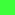

# Keyboard Layouts Galore

This site tries to encompas notes on how to choose and design  keyboard layouts. A large part of modern layouts is doing *layers*, *combos*, *macros*, tap, tap-hold etc. 

Contributions welcome :-)

## Why should you learn a new keyboard layout
* It will be an opportunity to finally learn proper typing technique, which will improve your speed and accuracy significantly. But also typing comfort.
* Learning a new layout will not automatically give you a speed increase. It will require a lot of hard work.
* Consider learning a new layout the same as people learning to play an instrument. It is fun to set onself a goal.
* Consider learning a layout the same challenge as playing mind games.  It is a mental exercise and opportunity to expand your mind.

## How to learn a new layout
See [How To Best Learn A New Layout](HowToBestLearnANewLayout.md)

## How to install keyboard layouts with simple software
See [Create A Keyboard Layout With Software](keymapping/CreateKeyboardLayoutsWithSoftware.md)

# Layouts are more alike thank you think! 

When first being to different keyboard layouts one is quickly overwhelmed by the  great variety. However, upon further scruitiny, the *similarities* of the homerow is surprising! Let's have a look at some keyboards layouts (no particular priority other than the most known QWERTY, DVORAK, COLEMAK).

### Sorted homerow of selected layouts
|Name          | | | | | | | | | | | | | | | | | | | | | | |
|-             |-|-|-|-|-|-|-|-|-|-|-|-|-|-|-|-|-|-|-|-|-|-|
|Qwerty        |'|;|A| | |D| |F|G|H| |J|K|L| | | | |S| | | |
|Dvorak        |-| |A| | |D|E| | |H|I| | | |N|O| | |S|T|U| |
|Colemak       |'| |A| | |D|E| | |H|I| | | |N|O| |R|S|T|
|Three Layout  | | |A| | |D|E| | |H|I| | | |N|O| |R|S|T|
|Hands Down Neu|,| |A|B| | |E| | |H|I|J| | |N| | |R|S|T|
|Engram        |,|.|A| |C| |E| | |H|I| | | |N| |Q| |S|T|
|Workman       |'| |A| | | |E| |G|H|I| | | |N|O| | |S|T| |Y|
|Canary        |'| |A| |C| |E|F|G| |I| | | |N| | |R|S|T|

Notice a great similarity among them  - of course with QWERTY being the most different to the rest.

Also notice the choice of infrequent letters:

* **Dvorak** prioritizing *U, -*
* **Colemak** prioritizing *'*
* **Workman** prioritizing *Y, '*
* **HandsDown** prioritizing *B, J* 
* **Engram** prioritizing *Q, C*
* **Canary** prioritizing *C, F*

### Actual homerow of selected layouts
|Name ||||||||||||
|-|-|-|-|-|-|-|-|-|-|-|-|
|Qwerty|A|S|D|F|G|H|J|K|L|;|'|
|Dvorak|A|O|E|U|I|D|H|T|N|S|-|
|Colemak|A|R|S|T|D|H|N|E|I|O|'|
|Workman|A|S|H|T|G|Y|N|E|O|I|'|
|Canary|C|R|S|T|G|F|N|E|I|A|' |
|Hands Down Neu|R|S|N|T|B|,|A|E|I|H|J|
|Engram|C|I|E|A|,|.|H|T|S|N|Q|
|Three Layout|O|H|E|A|I|D|R|T|N|S| |

### Visualisations
**qwerty**
<table><tr>
<td></td><td></td><td></td><td></td><td></td><td></td><td></td><td></td><td></td><td></td></tr><tr><td></td><td></td><td></td><td></td><td></td><td></td><td></td><td></td><td></td><td></td></tr><tr><td></td><td></td><td></td><td></td><td></td><td></td><td></td><td></td><td></td></tr></table>

**dvorak**
<table><tr>
<td></td><td></td><td></td><td></td><td></td><td></td><td></td><td></td><td></td><td></td><td></td></tr><tr><td></td><td></td><td></td><td></td><td></td><td></td><td></td><td></td><td></td><td></td><td></td></tr><tr><td></td><td></td><td></td><td></td><td></td><td></td><td></td><td></td><td></td><td></td></tr></table>

**Colemak**
<table><tr>
<td></td><td></td><td></td><td></td><td></td><td></td><td></td><td></td><td></td></tr><tr><td></td><td></td><td></td><td></td><td></td><td></td><td></td><td></td><td></td><td></td></tr><tr><td></td><td></td><td></td><td></td><td></td><td></td><td></td><td></td><td></td></tr></table>

**hands down**
<table><tr>
<td></td><td></td><td></td><td></td><td></td><td></td><td></td><td></td><td></td><td></td></tr><tr><td></td><td></td><td></td><td></td><td></td><td></td><td></td><td></td><td></td><td></td><td></td></tr><tr><td></td><td></td><td></td><td></td><td></td><td></td><td></td><td></td><td></td><td></td></tr></table>

**Engram**
<table><tr>
<td></td><td></td><td></td><td></td><td></td><td></td><td></td><td></td><td></td><td></td></tr><tr><td></td><td></td><td></td><td></td><td></td><td></td><td></td><td></td><td></td><td></td></tr><tr><td></td><td></td><td></td><td></td><td></td><td></td><td></td><td></td><td></td></tr></table>

**canary**
<table><tr>
<td></td><td></td><td></td><td></td><td></td><td></td><td></td><td></td><td></td><td></td></tr><tr><td></td><td></td><td></td><td></td><td></td><td></td><td></td><td></td><td></td><td></td><td></td></tr><tr><td></td><td></td><td></td><td></td><td></td><td></td><td></td><td></td><td></td><td></td></tr></table>

<!-- end visualisation  -->

### English Letter frequencies
Since the real estate of the home row is king, we should expect the most frequently used keys here. Of course there are considerations such as finger travel, same finger usage etc  never the less it is interesting to compare with the letter frequencies of english. (source: https://en.wikipedia.org/wiki/Letter_frequency).

|Letter|Frequency
|-| -|
|E|	12.7%	|
|T|	9.1%	|
|A|	8.2%	|
|O|	7.5%	|
|I|	7.0%	|
|N|	6.7%	|
|S|	6.3%	|
|H|	6.1%	|
|R|	6.0%	|
|D|	4.3%	|
|L|	4.0%	|
|C|	2.8%	|
|U|	2.8%	|
|M|	2.4%	|

### Letter Frequency in the English Language
 
    e t a o i n s r h l d c u m f p g w y b v k x j q z

 
### Letter Frequency in the Oxford Dictionary
 
    e a r i o t n s l c u d p m h g b f y w k v x z j q

### Pitfalls of letter frequencies
 
A note on frequencies. There are a number of issues when turning to letter frequences during keyboard layout design

First, frequences reveals a lot about the language we *read*, but **nothing** about the language we *edit*. Editing is a big part of writing, so in order to design and choose a keyboard, one must understand how we interact with the keyboard while editing. E.g.  `backspace` is probably one of the most used keys along with cursor keys! Use a keylogger! On windows a free privacy centered logger is https://github.com/kbilsted/KeyboordUsage 

Second, there are differences between frequencies used in texts/books, and just ploving through dictionaries. Frequencies are also very language dependent E.g. the letter *E* is used more often in english than in german.

Third, the majority of people who are interested in tweaking their keyboard do programming activities, where frequencies of symbols such as `( { [ < , $ " \ : ; > ] } )` should be taken into consideration.

### C# symbol and number frequencies
These frequencies are from a smallish personal collection. They are very scewed. For example, in the editor pressing `///` will type out 9 slashes! When typing an open parenthesis such as `(` the editor will auto complete `)`.

Finally AI models auto complete more and more code these days.. We must advice to use a keylogger to get real editing experiences

| symbol | Count | Frequnecy |
| -      | -     |         - |
|  | 477098 | 23,43% |
|\n| 278341 | 13,67% |
| /| 190978 | 9,38% |
| .| 133025 | 6,53% |
| )| 104010 | 5,11% |
| (| 104005 | 5,11% |
| ;| 76137 | 3,74% |
| "| 70453 | 3,46% |
| ,| 67650 | 3,32% |
| \|| 63009 | 3,09% |
| >| 61351 | 3,01% |
| <| 56574 | 2,78% |
| -| 39304 | 1,93% |
| _| 36189 | 1,78% |
| }| 35930 | 1,76% |
| {| 35887 | 1,76% |
| 2| 25278 | 1,24% |
| 0| 24924 | 1,22% |
| 1| 18393 | 0,90% |
| 3| 13470 | 0,66% |
| [| 13393 | 0,66% |
| ]| 13387 | 0,66% |
| 4| 8573  | 0,42% |
| +| 8555  | 0,42% |

For an actual case stydy see [CSharp code analysis vs keyloging.md](CSharp%20code%20analysis%20vs%20keyloging.md)

# Layouts notes
a list of notes on keyboard layouts very limited [keyboard layouts notes](keyboard-layouts.md)

## Keyboard visualisation tools

* design keyboard layouts with layers 
  * https://keymap-drawer.streamlit.app/
  * https://jaroslaw-weber.github.io/keyfab/
* design keyboard layouts with nice graphics http://www.keyboard-layout-editor.com/

# Keyboard layering
A very easy to understand and "low tech" approach is to remap the ALT keys as shown in the "Red-BLUE" layout. https://www.youtube.com/watch?v=92pRAQeRIak&ab_channel=RomanStrakhov

 # Appendix

## Inspiring videos
* Gentle introduction to keyboard layout design principles (frequency, rolls, etc) and then how he designed a one-handed keyboard: https://www.youtube.com/watch?v=xDQXokCON-w&ab_channel=sandsquare
* https://www.youtube.com/watch?v=McHurKmk-rQ&t=22s
  

## Inspiring articles 
* https://www.jonashietala.se/blog/2023/11/02/i_designed_my_own_keyboard_layout_was_it_worth_it/
* https://docs.google.com/document/d/1_a5Nzbkwyk1o0bvTctZrtgsee9jSP-6I0q3A0_9Mzm0/edit Go to document for understanding keyboard metrics
 

# tooling 
Keyboard Layout Files Creator https://github.com/39aldo39/klfc

## Designing a programmers keyboard layout for programmers

from: http://xahlee.info/kbd/semicolon_vs_apostrophe_frequency_in_computer_languages.html 

Here is a table of their frequency.

Semicolon and Apostrophe Frequency in Computer Languages

    lang	semicolon ;	  apostrophe '
    Java	      8.0%	  0.5%
    C	          6.9%	  0.8%
    C++	        3.5%	  0.2%
    Python	    0.2%    10.6%
    Ruby	      0.3%    4.4%
    Bash	      1.1%    6.9%
    PHP	        5.1%	   .5%
    Perl	     4.9%     6.1%
    JavaScript	5.2%	  6.8%
If you code {C, C++, Java}, then semicolon is far more frequent.

* If you code in {Python, Ruby, Bash}, apostrophe is  ar more frequent.
* If you code in {PHP, Perl, JavaScript}, apostrophe  s still more frequent.
* in English, the semicolon is almost never used, apostrophe is used often. (e.g. it's, that's, 'single quotes')

## Various keyboard tricks
[Keyboards Tips.md](keyboards-tips.md)

## Notes on short cuts
Various short cuts for programs and operating systems

###  Windows
	
* Jump-to or start application: `Windows + <number>` 

* Outlook
	* Next item: `Ctrl + .`
	* Previous item: `Ctrl + ,`
	* Delete item: `Ctrl + d`
